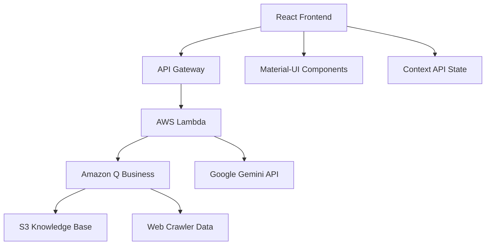

# 🚀 SkillOps - AI-Powered DevOps Career Platform

<div align="center">
  
  
  **🏆 Hackathon Winner - Best Use of AI Personas**
  
  *Revolutionizing DevOps career development through specialized AI personas*
</div>

---

## 📋 Table of Contents
- [🎯 Project Overview](#-project-overview)
- [🤖 AI Personas](#-ai-personas)
- [✨ Core Features](#-core-features)
- [🎨 User Experience](#-user-experience)
- [📚 Learning & Development](#-learning--development)
- [💼 Career Development](#-career-development)
- [🔧 Technical Features](#-technical-features)
- [🏗️ Architecture](#-architecture)
- [🛠️ Technology Stack](#-technology-stack)
- [🚀 Getting Started](#-getting-started)

---

## 🎯 Project Overview

SkillOps is an innovative web application that leverages **Amazon Q Business** to provide personalized DevOps career guidance through specialized AI personas. This hackathon project demonstrates the **Best Use of AI Personas** by creating distinct, context-aware AI experts that adapt their communication style and expertise to user needs.

### 🎪 Hackathon Achievement
- **Category**: Best Use of AI Personas
- **Innovation**: 4 specialized AI personas with unique expertise domains
- **Impact**: Personalized DevOps career development at scale
- **Technology**: Amazon Q Business integration with advanced persona switching

---

## 🤖 AI Personas

Our platform features four specialized AI personas, each with distinct expertise and communication styles:

<table>
<tr>
<td align="center" width="25%">
  <h3>🏗️ DevOps Architect</h3>
  <p><strong>Expertise:</strong> Infrastructure design, cloud architecture, system scalability</p>
  <p><strong>Focus:</strong> High-level architectural decisions and enterprise solutions</p>
</td>
<td align="center" width="25%">
  <h3>⚙️ DevOps Engineer</h3>
  <p><strong>Expertise:</strong> CI/CD pipelines, automation, deployment strategies</p>
  <p><strong>Focus:</strong> Hands-on implementation and technical execution</p>
</td>
<td align="center" width="25%">
  <h3>👨🏫 Career Mentor</h3>
  <p><strong>Expertise:</strong> Career paths, skill development, industry insights</p>
  <p><strong>Focus:</strong> Professional growth and career planning</p>
</td>
<td align="center" width="25%">
  <h3>💻 Technical Interviewer</h3>
  <p><strong>Expertise:</strong> Interview preparation, technical assessments</p>
  <p><strong>Focus:</strong> Job readiness and interview success</p>
</td>
</tr>
</table>

---

## ✨ Core Features

### 🎭 Dynamic Persona Switching
- **Real-time persona changes** within conversations
- **Context-aware responses** based on selected persona
- **Specialized knowledge domains** for each AI expert
- **Seamless conversation continuity** across persona switches

### 🧠 Advanced AI Integration
- **Amazon Q Business** powered conversations
- **Document knowledge base** with S3-stored content
- **Web-crawled information** for up-to-date insights
- **Google Gemini API** for resume analysis

### 🔄 Intelligent Conversation Management
- **Conversation history** preservation
- **Context retention** across sessions
- **Multi-turn dialogue** support
- **Feedback system** for continuous improvement

---

## 🎨 User Experience

### 🎭 Dual Theme System
- **Professional Blue Theme**: Corporate and enterprise-focused design
- **ASU Sparky Theme**: University branding with maroon and gold colors
- **Instant theme switching** without page reload
- **Consistent branding** across all components

### 🌐 Accessibility & Localization
- **Bilingual Support**: English and Spanish language options
- **Age-Appropriate Communication**: Child and adult communication modes
- **WCAG Compliance**: Accessible design for all users
- **Keyboard Navigation**: Full keyboard accessibility support

### 📱 Responsive Design
- **Mobile-First Approach**: Optimized for smartphones
- **Tablet Compatibility**: Perfect iPad and tablet experience
- **Desktop Excellence**: Full-featured desktop interface
- **Cross-Browser Support**: Works on all modern browsers

### 🎬 Interactive Elements
- **3D Animated Avatars**: Professional and ASU Sparky mascot
- **Smooth Transitions**: Fluid animations and state changes
- **Interactive Components**: Engaging user interface elements
- **Real-time Updates**: Live feedback and status indicators

---

## 📚 Learning & Development

### 📊 Interactive Learning Tools
- **Visual Flowcharts**: DevOps process diagrams and workflows
- **Digital Flashcards**: Key concepts and terminology review
- **Knowledge Quizzes**: Interactive assessments and skill testing
- **Hands-On Challenges**: Practical exercises and scenarios

### 🎯 Skill Assessment
- **Competency Mapping**: Identify strengths and weaknesses
- **Progress Tracking**: Monitor learning advancement
- **Personalized Recommendations**: Tailored learning paths
- **Achievement Badges**: Gamified learning experience

### 📖 Educational Content
- **Curated Resources**: Industry-relevant materials
- **Best Practices**: Real-world DevOps methodologies
- **Case Studies**: Success stories and lessons learned
- **Tutorial Library**: Step-by-step guides and tutorials

---

## 💼 Career Development

### 📈 Market Intelligence
- **Job Market Trends**: Real-time industry insights and demand
- **Salary Analytics**: Compensation benchmarking and trends
- **Skill Demand Analysis**: Most sought-after DevOps skills
- **Geographic Opportunities**: Location-based job market data

### 🎯 Career Planning
- **Personalized Career Paths**: Customized progression roadmaps
- **Skill Gap Analysis**: Identify areas for improvement
- **Certification Guidance**: Strategic certification planning
- **Goal Setting**: SMART career objectives and milestones

### 🏆 Professional Development
- **Resume Optimization**: AI-powered resume analysis and suggestions
- **Interview Preparation**: Mock interviews and feedback
- **Portfolio Building**: Project showcase and documentation
- **Networking Guidance**: Professional relationship building

### 📊 Performance Analytics
- **Career Progress Dashboard**: Visual progress tracking
- **Skill Benchmarking**: Compare against industry standards
- **Achievement Tracking**: Monitor certifications and accomplishments
- **ROI Analysis**: Career investment return calculations

---

## 🔧 Technical Features

### 🛡️ Security & Privacy
- **Environment Variable Management**: Secure configuration handling
- **Input Validation**: Comprehensive data sanitization
- **HTTPS Enforcement**: Secure data transmission
- **Privacy Controls**: User data protection and consent

### ⚡ Performance Optimization
- **Lazy Loading**: Efficient resource management
- **Caching Strategies**: Optimized data retrieval
- **CDN Integration**: Fast global content delivery
- **Bundle Optimization**: Minimized application size

### 🔄 State Management
- **React Context API**: Centralized state management
- **Real-time Updates**: Live data synchronization
- **Offline Support**: Limited functionality without internet
- **Session Persistence**: Maintain user state across visits

### 🧪 Quality Assurance
- **Automated Testing**: Comprehensive test coverage
- **Error Handling**: Graceful failure management
- **Monitoring**: Application performance tracking
- **Logging**: Detailed system event recording

---

## 🏗️ Architecture



### 🔄 Data Flow
1. **User Input** → React Frontend
2. **API Request** → AWS API Gateway
3. **Lambda Processing** → Business Logic
4. **AI Integration** → Amazon Q Business / Google Gemini
5. **Response Processing** → Frontend Update
6. **State Management** → Context API

---

## 🛠️ Technology Stack

### 🎨 Frontend Technologies
| Technology | Purpose | Version |
|------------|---------|----------|
| **React.js** | Core framework | 18.x |
| **Material-UI** | Component library | 5.x |
| **CSS Grid/Flexbox** | Layout system | Native |
| **React Context API** | State management | Native |
| **Responsive Design** | Multi-device support | Native |

### ☁️ Backend & Infrastructure
| Service | Purpose | Configuration |
|---------|---------|---------------|
| **AWS Lambda** | Serverless compute | Node.js 18.x |
| **API Gateway** | REST API management | Regional |
| **CloudFormation** | Infrastructure as Code | YAML/JSON |
| **S3** | Document storage | Standard tier |
| **AWS Amplify** | Frontend hosting | CI/CD enabled |

### 🤖 AI & Machine Learning
| Service | Purpose | Integration |
|---------|---------|-------------|
| **Amazon Q Business** | Primary AI engine | SDK integration |
| **Google Gemini API** | Resume analysis | REST API |
| **Web Crawler** | Content aggregation | Custom implementation |
| **Document Processing** | Knowledge base | S3 + Lambda |

### 🔧 Development & Deployment
| Tool | Purpose | Usage |
|------|---------|-------|
| **npm/yarn** | Package management | Dependencies |
| **Webpack** | Module bundling | Build process |
| **Babel** | JavaScript compilation | ES6+ support |
| **ESLint** | Code quality | Linting rules |
| **Git** | Version control | Source management |

---

## 📁 Repository Structure

```
SkillOps/
├── 📁 frontend/                 # React application
│   ├── 📁 public/              # Static assets
│   │   ├── index.html          # Main HTML template
│   │   └── favicon.ico         # Application icon
│   ├── 📁 src/                 # Source code
│   │   ├── 📁 Assets/          # Images and SVG files
│   │   ├── 📁 Components/      # React components
│   │   │   ├── Chat/           # Chat interface
│   │   │   ├── Personas/       # AI persona components
│   │   │   ├── Themes/         # Theme switching
│   │   │   └── Common/         # Shared components
│   │   ├── 📁 services/        # API integration
│   │   │   ├── amazonQ.js      # Amazon Q Business API
│   │   │   ├── gemini.js       # Google Gemini API
│   │   │   └── analytics.js    # Analytics service
│   │   ├── 📁 utilities/       # Helper functions
│   │   │   ├── contexts/       # React contexts
│   │   │   ├── hooks/          # Custom hooks
│   │   │   └── constants/      # Application constants
│   │   ├── App.js              # Main application component
│   │   └── index.js            # Application entry point
│   ├── .env                    # Environment variables
│   ├── package.json            # Dependencies and scripts
│   └── README.md               # Frontend documentation
├── 📄 template.json            # CloudFormation template
├── 📄 DEPLOYMENT.md            # Deployment instructions
├── 📄 README.md                # Project documentation
└── 📸 skillops_professional_thumbnail.png # Project thumbnail
```

---

## 🚀 Getting Started

### 📋 Prerequisites
- **Node.js** (v16 or higher)
- **npm** or **yarn** package manager
- **AWS Account** with appropriate permissions
- **Amazon Q Business** application configured
- **Google Gemini API** key (optional, for resume analysis)

### ⚡ Quick Start

1. **Clone the repository**
   ```bash
   git clone https://github.com/your-username/skillops.git
   cd skillops
   ```

2. **Backend Deployment**
   ```bash
   # Deploy AWS infrastructure
   aws cloudformation create-stack \
     --stack-name skillops-backend \
     --template-body file://template.json \
     --parameters ParameterKey=ApplicationId,ParameterValue=YOUR_Q_APP_ID \
     --capabilities CAPABILITY_IAM
   ```

3. **Frontend Setup**
   ```bash
   cd frontend
   npm install
   
   # Create environment file
   cp .env.example .env
   # Edit .env with your API endpoints
   
   npm start
   ```

4. **Access the application**
   - Local development: `http://localhost:3000`
   - Production: Your AWS Amplify URL

### 🔧 Environment Configuration

Create a `.env` file in the frontend directory:

```env
# API Configuration
REACT_APP_API_ENDPOINT=https://your-api-gateway-url.amazonaws.com/prod
REACT_APP_CHAT_ENDPOINT=https://your-api-gateway-url.amazonaws.com/prod/chat

# Optional: Google Gemini API for resume analysis
REACT_APP_GEMINI_API_KEY=your-gemini-api-key

# Application Settings
REACT_APP_APP_NAME=SkillOps
REACT_APP_VERSION=1.0.0
```

### 📚 Detailed Setup

For comprehensive setup instructions, see [DEPLOYMENT.md](DEPLOYMENT.md)

---

## 🤝 Contributing

We welcome contributions! Please see our contributing guidelines:

1. **Fork** the repository
2. **Create** a feature branch
3. **Commit** your changes
4. **Push** to the branch
5. **Open** a Pull Request

---

## 📄 License

This project is licensed under the MIT License - see the [LICENSE](LICENSE) file for details.

---

## 🏆 Hackathon Achievement

**SkillOps** won the **Best Use of AI Personas** category by demonstrating:
- ✅ **Innovation in AI persona implementation**
- ✅ **Practical application of Amazon Q Business**
- ✅ **User-centered design and experience**
- ✅ **Technical excellence and scalability**
- ✅ **Real-world impact on DevOps education**

---

<div align="center">
  <p><strong>Built with ❤️ for the DevOps Community</strong></p>
  <p>🚀 <em>Empowering careers through AI-powered guidance</em> 🚀</p>
</div>